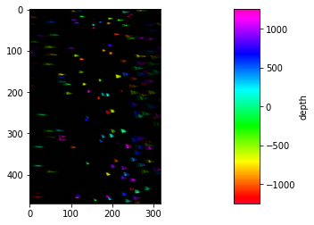
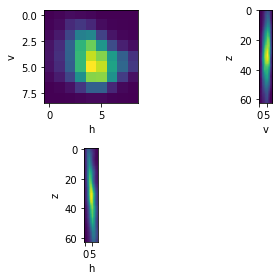

# Pycroscopy
---

Pycroscopy is a collection of tools for microscopy.

### Features
- Uses [multipagetiff](https://github.com/mpascucci/multipagetiff) for easy 3D stack manipulation
- Includes an **average PSF** measurement from a volumetric image of point-like objects

### upcoming features
- stacks <--> 4D hyperstack
- 3D deconvolution

## Example use


```python
import pycroscopy as pycro
```


```python
# load a stack (volumetric image) of fluorescent beads
stack_path = "./psf_stack.tiff"
s = pycro.read_stack(stack_path)
s
```


    Multi-Page Stack of 2500 pages. (dx=dy=1, dz=1, crop=[0, 470, 0, 317]], page limits=[0, 2500])


```python
# plot the Z-max-projection of the stack
pycro.plot_flatten(s)
```


    

    


```python
# initialize the average PSF calculation
psf = pycro.PSF(s,size_tolerance=0.7)
psf
```


    PSF generator: found 33 objects, 17 rejected (wrong size).


```python
# Calculate the average PSG
psf.calc_mean_psf()
```

    Find centroids: 100%|██████████| 16/16 [00:57<00:00,  3.62s/it]
    Crop PSFs: 100%|██████████| 16/16 [00:00<00:00, 12555.45it/s]


```python
# plot the mean PSF
mean_psf = psf.mean_PSF
pycro.orthogonal_views(mean_psf)
```


    

    

